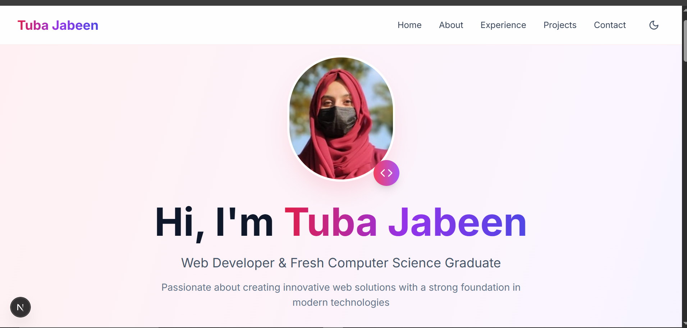

# 🌟 Tuba Jabeen - Portfolio Website

A modern, responsive portfolio website built with Next.js, showcasing my journey as a Computer Science graduate and Web Developer.

## 🚀 Live Demo
https://portfolio-69sz.vercel.app/

## ✨ Features

- **🎨 Modern Design** - Beautiful gradient themes with smooth animations
- **🌙 Dark/Light Mode** - Toggle between themes with smooth transitions
- **📱 Fully Responsive** - Optimized for all devices and screen sizes
- **⚡ Fast Performance** - Built with Next.js for optimal loading speeds
- **🎯 SEO Optimized** - Proper meta tags and semantic HTML structure
- **🔄 Smooth Animations** - Professional hover effects and transitions
- **📧 Contact Integration** - Direct email and social media links
- **🎭 Interactive UI** - Engaging user experience with modern components

## 🛠️ Built With

- **[Next.js 14](https://nextjs.org/)** - React framework for production
- **[React 18](https://reactjs.org/)** - JavaScript library for building user interfaces
- **[Tailwind CSS](https://tailwindcss.com/)** - Utility-first CSS framework
- **[Lucide React](https://lucide.dev/)** - Beautiful & consistent icon toolkit
- **[Radix UI](https://www.radix-ui.com/)** - Low-level UI primitives
- **[Class Variance Authority](https://cva.style/)** - Creating variant APIs

## 📁 Project Structure

\`\`\`
portfolio-website/
├── app/
│   ├── globals.css          # Global styles and Tailwind CSS
│   ├── layout.js           # Root layout component
│   └── page.js             # Main portfolio page
├── components/
│   └── ui/
│       ├── badge.jsx       # Badge component
│       ├── button.jsx      # Button component
│       └── card.jsx        # Card component
├── lib/
│   └── utils.js            # Utility functions
├── public/                 # Static assets
├── jsconfig.json          # JavaScript configuration
├── next.config.js         # Next.js configuration
├── package.json           # Dependencies and scripts
├── postcss.config.js      # PostCSS configuration
├── tailwind.config.js     # Tailwind CSS configuration
└── README.md              # Project documentation
\`\`\`

## 🚀 Getting Started

### Prerequisites

- Node.js 18.0 or later
- npm or yarn package manager

### Installation

1. **Clone the repository**
   \`\`\`bash
   git clone https://github.com/TubaJabeen123/Portfolio.git
   cd portfolio-website
   \`\`\`

2. **Install dependencies**
   \`\`\`bash
   npm install
   # or
   yarn install
   \`\`\`

3. **Run the development server**
   \`\`\`bash
   npm run dev
   # or
   yarn dev
   \`\`\`

4. **Open your browser**
   Navigate to [http://localhost:3000](http://localhost:3000) to see the portfolio.

## 📱 Sections

- **🏠 Hero** - Introduction with profile image and call-to-action
- **👨‍💻 About** - Education, achievements, skills, and extracurriculars
- **💼 Experience** - Current internship and work experience
- **🚀 Projects** - Featured projects with technologies used
- **📞 Contact** - Multiple ways to get in touch

## 📄 License

This project is licensed under the MIT License - see the [LICENSE](LICENSE) file for details.

## 👨‍💻 About Me

I'm Tuba Jabeen, a fresh Computer Science graduate from COMSATS University Islamabad, Attock, with a passion for web development and creating innovative digital solutions.

- **🎓 Education**: Bachelor of Science in Computer Science (CGPA: 3.54/4.00)
- **💼 Current Role**: Self-employed
- **🌟 Interests**: Web Development, UI/UX Design
- **📍 Location**: Attock, Pakistan

## 📞 Contact

- **📧 Email**: [tubajabeen105@gmail.com](mailto:tubajabeen105@gmail.com)
- **💼 LinkedIn**: [tuba-jabeen-21993a223](https://www.linkedin.com/in/tuba-jabeen-21993a223)

\
